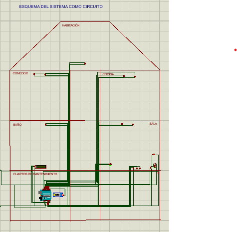
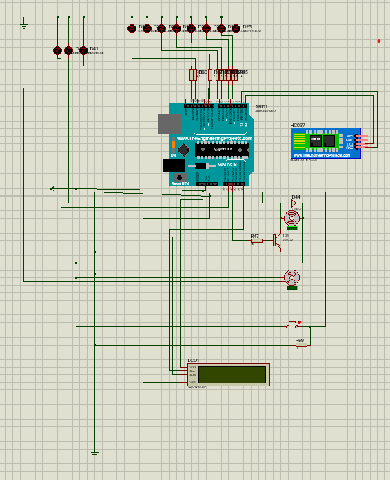

#### UNIVERSIDAD DE SAN CARLOS DE GUATEMALA
#### FACULTAD DE INGENIERÍA
#### ESCUELA DE CIENCIAS Y SISTEMAS
#### ORGANIZACIÓN COMPUTACIONAL
#### SEGUNDO SEMESTRE 2025
#### ING. OTTO RENE ESCOBAR
#### AUX: DILAN CONAHER SUY MIRANDA


 


<p align="center">
  <strong>PRÁCTICA 3</strong>
  <br>
  <strong>Carrusel Automatizado con control de Acceso Seguro</strong>
</p>

<br>
<br>

<div align="center">

| No. | Nombre | Carné |
| :--- | :--- | :--- |
| 1 | Francisco Javier Cetino Mendez | 202006716 |
| 2 | Karvin Armaldo Lago Pérez | 202200254 |
| 3 | José Alexander López López | 202100305 |
| 4 | Lesly Mariela Chojolán Rubio | 201807024 |

</div>

---

## PORCENTAJE DE PARTICIPACION 
| No | Nombre                                        | Porcentaje de Participacion      |
|----|-----------------------------------------------|-----------|
| 1  | Francisco Javier Cetino Mendez                   | 25% |
| 2  | Karvin Armaldo Lago Pérez             | 25%  |
| 3  | José Alexander López López              | 25%  |
| 4  | Lesly Mariela Chojolán Rubio             | 25%  |

---
# INDICE

1. Introducción
2. Objetivos
3. Lógica del Sistema
4. Diagramas del Diseño del Circuito
5. Configuracion Bluethooth
6. Equipo Utilizado y Presupuesto
7. Conclusiones y Recomendaciones

---

##  Introducción y Objetivos

### Introducción
El desarrollo de sistemas digitales modernos integra tanto la lógica combinacional
como la lógica secuencial para resolver problemas prácticos en el ámbito de la
ingeniería. En este contexto, la presente práctica consiste en diseñar e implementar
un carrusel automatizado con control de acceso seguro, aplicando conceptos
fundamentales de flip-flops, contadores, comparadores y circuitos de control de
potencia.
El proyecto busca simular una atracción mecánica que no solo funcione de forma
confiable, sino que también incorpore un mecanismo de seguridad que garantice
que únicamente los usuarios autorizados puedan activarlo. Para ello, se implementa
un sistema de autenticación por contraseña digital, un contador de errores con
alarma, y un control secuencial del motor DC mediante puente H, coordinado con
indicadores visuales y temporización.
La práctica representa un ejercicio integrador donde se aplican los principios
teóricos vistos en clase a un caso práctico, fomentando el diseño modular y la
correcta interacción entre componentes electrónicos. Al finalizar, se espera contar
con una maqueta funcional que demuestre el uso de la electrónica digital como base
de sistemas automatizados y de control en aplicaciones reales. 

### Objetivos

**General:**
* Diseñar e implementar una maqueta funcional de una casa inteligente que permita configurar y activar escenas luminosas predefinidas mediante un archivo .org, almacenadas en memoria EEPROM del Arduino, y controlar dispositivos como luces y un ventilador mediante comandos locales o inalámbricos, demostrando la integración práctica de microcontroladores, gestión de memoria y comunicación digital en sistemas automatizados.

**Específicos:**
* Implementar un sistema de almacenamiento de escenas luminosas, utilizando la memoria EEPROM interna del Arduino, garantizando persistencia tras reinicios y permitiendo la recuperación de configuraciones sin intervención manual.
* Diseñar una interfaz de configuración que permita cargar escenas desde una PC mediante un archivo con extensión .org, validando su sintaxis y procesando los comandos para actualizar el estado de los ambientes y el ventilador.
* Integrar un módulo Bluetooth para permitir el control remoto de los ambientes desde un dispositivo móvil, ejecutando comandos y proporcionando retroalimentación visual mediante una pantalla LCD y LEDs de estado.

---

# LOGICA DEL SISTEMA

El sistema está compuesto por los siguientes módulos y flujos de funcionamiento:

1. **Módulo de Configuración:**  
   El módulo de configuración es en esencia, un analizador sintáctico que se ejecuta en el Arduino. Su trabajo es recibir un archivo de texto .org enviado desde la PC a través del cable USB, entenderlo y, si es válido, guardar permanentemente esas configuraciones en la memoria EEPROM.

2. **Módulo:**  
   Esta lógica se activa al recibir datos por el módulo Bluetooth (HC-06). 
   
   Recepción de Comandos: El sistema espera uno de los siguientes comandos de texto:
   
   modo_fiesta 


    modo_relajado 


    modo_noche 


    encender_todo 


    apagar_todo  


    Ejecución de Comandos:

    El Arduino lee la configuración para ese modo específico (ej. modo_fiesta) desde la memoria EEPROM.


    Aplica los estados guardados (enciende/apaga los LEDs y el ventilador correspondientes a ese modo).

    Actualiza la Pantalla LCD inmediatamente con la información del modo activado.


    Envía un mensaje de confirmación de regreso por Bluetooth.

    El LED Verde (L2) parpadea brevemente para indicar un comando exitoso.

    Si el comando es estado, simplemente responde por Bluetooth con el modo actual (ej. "Modo: FIESTA").


    Lógica de Error (Comando Inválido):

    Si el texto recibido no coincide con ninguno de los comandos válidos.

    Se enciende el LED Rojo (L3).

    La LCD muestra: "ERROR: Modo inválido".

3. **MODOS:**  
   | Modo | Mensaje en LCD |
    | :--- | :--- |
    | `modo_fiesta` | Modo: FIESTA.<br>Ventilador: ON, LED'S: Alternandose |
    | `modo_relajado` | Modo: RELAJADO.<br>Ventilador: OFF, LED'S: OFF |
    | `modo_noche` | Modo: NOCHE.<br>Ventilador: OFF, LED'S: OFF |
    | `encender_todo` | LED'S: ON.<br>Ventilador: ON. |
    | `apagar_todo` | LED'S: OFF.<br>Ventilador: OFF. |
    | `Error` | ERROR: Modo inválido |

Esta lógica permite una interacción fluida entre el hardware y software, brindando al usuario una experiencia completa y educativa en el diseño y control de sistemas combinacionales.

# Funciones Booleanas para una Memoria RAM con Flip-Flops D en Proteus

Para implementar una memoria RAM (Random Access Memory) usando flip-flops tipo D en Proteus, necesitamos definir varias funciones booleanas que controlen su funcionamiento. A continuación se explican las funciones principales:

---

## Componentes principales de una memoria RAM

- **Matriz de celdas de memoria** (flip-flops D)  
- **Decodificador de direcciones**  
- **Circuitos de control de lectura/escritura**  
- **Buffers de entrada/salida**

---

## Diagrama Esquemático del Circuito (Proteus)
 
* LEDs de ambientes (Sala, Comedor, Cocina, Baño, Habitación)
* Motor DC (Ventilador)
* Servomotor (Puerta)
* Botón de la puerta
* LEDs de estado (Azul, Verde, Rojo)
* Pantalla LCD I2C
* Módulo Bluetooth (HC-06)





---
# EQUIPO UTILIZADO Y PRESUPUESTO  
## PRESUPUESTO  

| Cantidad | Componente / Material | Precio unitario (Q) | Precio total (Q) | Fuente |
| :--- | :--- | :--- | :--- | :--- |
| 16 | LED Tricolor | Q1.50 | Q24.00 | Estimado basado en precios promedio locales |
| 3 | Protoboard 830 | Q38.00 | Q114.00 | [Electrónica DIY Guatemala](https://www.electronicadiy.com/products/protoboard-830) |
| 80 | Jumper (MxM) | Q0.80 | Q64.00 | Estimado basado en kits de 10 piezas por Q8.00 |
| 1 | Pantalla LCD 16x2 | Q33.00 | Q33.00 | [Electrónica DIY Guatemala](https://www.electronicadiy.com/products/pantalla-lcd-1602) |
| 1 | Bluetooth HC-06 | Q60.00 | Q60.00 | [Electrónica DIY Guatemala](https://www.electronicadiy.com/products/bluetooth-hc-06) |
| 1 | Arduino Uno | Q95.00 | Q95.00 | Estimado basado en precios promedio locales |
| 16 | Resistencia 330Ω | Q0.50 | Q8.00 | Estimado basado en precios promedio locales |
| 1 | Cinta de aislar | Q30.00 | Q30.00 | Estimado basado en precios promedio locales |
| 1 | Metro Termoencogible | Q3.00 | Q3.00 | Estimado basado en precios promedio locales |
| **—** | **Materiales para maqueta** | **—** | **—** | **—** |
| 2 | Cartón espuma | Q20.00 | Q40.00 | Tienda de materiales de arte |
| 4 | Papel tapiz para maqueta | Q7.00 | Q28.00 | Tienda de materiales para arquitectura |
| 4 | Hojas de mueblería (escala 1:25) | Q10.00 | Q40.00 | Estimado basado en papelerías locales |
| 1 | Silicón líquido | Q15.00 | Q15.00 | Tienda de manualidades |
| 2 | Barras de silicón caliente | Q2.00 | Q4.00 | Tienda de ferretería |
| 1 | Papel arcoíris negro | Q8.00 | Q8.00 | Papelería local |
| 1 | Papel arcoíris con textura | Q8.00 | Q8.00 | Papelería local |
| 1 | Hoja de acetato | Q4.00 | Q4.00 | Papelería local |
| | **Total general** |  | **Q586.00** | |


# Conclusiones 
1. Persistencia de Datos: Se implementó con éxito el almacenamiento de los modos de operación (escenas) en la memoria EEPROM interna del Arduino. Esto demostró ser una solución robusta que garantiza que el sistema recupere su configuración predefinida después de un corte de energía o un reinicio, cumpliendo con un requisito clave del proyecto.
2. Validación de Sintaxis: El diseño de un analizador (parser) para el archivo .org fue fundamental para la configuración del sistema. Se concluye que la validación estricta de la sintaxis (buscando conf_ini, conf:fin y comandos válidos) es un paso crítico para prevenir la corrupción de datos en la EEPROM y asegurar un funcionamiento predecible.
3. Gestión de Prioridades: La integración de dos canales de entrada (Serial USB y Bluetooth) requirió una lógica de priorización. La decisión de bloquear los comandos de Bluetooth durante la carga del archivo .org  fue esencial para mantener la integridad de los datos y la estabilidad del sistema, evitando conflictos de comandos.

# Recomendaciones

1. Optimización de Escritura EEPROM: Para aumentar la vida útil de la memoria EEPROM (que tiene un número limitado de ciclos de escritura), se recomienda implementar una verificación antes de guardar. El Arduino debería primero leer la dirección de memoria y solo escribir el nuevo valor si es diferente al que ya está almacenado.
2. Expandir el Parser .org: Se recomienda ampliar la flexibilidad del archivo .org. En lugar de solo definir modos fijos (fiesta, noche, etc.), se podría mejorar el parser para que el usuario defina los estados de cada ambiente individualmente (ej. sala:ON, cocina:OFF, ventilador:ON) y los asigne a un nombre de modo personalizado.
3. Interfaz Gráfica Móvil: Aunque el uso de una terminal serial Bluetooth cumple con los requisitos, se recomienda desarrollar una aplicación móvil dedicada (por ejemplo, en MIT App Inventor o Android Studio). Esto mejoraría drásticamente la experiencia del usuario, reemplazando los comandos de texto  con botones gráficos e intuitivos.
---
# Anexos
    Fotos reales de la maqueta 
  
  

## Código Fuente Comentado (.ino)

```cpp
#include <LiquidCrystal.h>
#include <EEPROM.h>
#include <Wire.h>
#include <LiquidCrystal_I2C.h>
#include <Servo.h>
#include <SoftwareSerial.h>

const int ledSala = 2;
const int ledComedor = 3;
const int ledCocina = 4;
const int ledBano = 5;
const int ledHabitacion = 6;
const int ledAzul = 13;
const int ledVerde = 7;
const int ledRojo = 14;//8
const int pinVentilador = 10;
const int pinServo = 11;
const int pinBotonPuerta = 12;
bool puertaAbierta = true;

Servo servoPuerta;
SoftwareSerial bluetooth(9, 8);
LiquidCrystal_I2C lcd(0x27, 16, 2);

struct Modo {
  bool leds[5];
  bool ventilador;
  const char* nombre;
};

const int eepromBase = 0;
const int modoCount = 5;
const int blockSize = 6;
Modo modos[modoCount] = {
  {{true, false,true,false,true}, true, "FIESTA"},
  {{true,true,true,true,true}, false, "RELAJADO"},
  {{false,false,false,false,false}, false, "NOCHE"},
  {{true,true,true,true,true}, true, "ENCENDERTODO"},
  {{false,false,false,false,false}, false, "APAGARTODO"}
};
// Pines asociados a cada ambiente
const int pinesAmbientes[5] = {ledSala, ledComedor, ledCocina, ledBano, ledHabitacion};
const char* nombresAmbientes[5] = {"sala", "comedor", "cocina", "bano", "habitacion"};
int modoActual = 4;

bool cargandoArchivo = false;
int modoCargando = -1;
int cini=0;
int cmodo=0;

void guardarModosEnEEPROM() {//se guarda cada modo en la memo EEPROM,guardando el array de modos como 1 para true y 0 para false
  for (int i=0; i<modoCount; i++) {
    int addr = eepromBase + i*blockSize;
    for (int j=0; j<5; j++) {
      EEPROM.write(addr+j, modos[i].leds[j] ? 1 : 0);
    }
    EEPROM.write(addr+5, modos[i].ventilador ? 1 : 0);
  }
  Serial.println("Guardando modos");
}

void cargarModosDesdeEEPROM() {//cargando los modos, es leer la eeprom
  for (int i=0; i<modoCount; i++) {
    int addr = eepromBase + i*blockSize;
    for (int j=0; j<5; j++) {//lena un array de modos, segun el array formado, por lo que se guardó a la memora
      modos[i].leds[j] = EEPROM.read(addr+j) == 1;//localiza cada led de cada modo, leyendo la dirección de memoria donde se ubica en la EEPROM
    }
    modos[i].ventilador = EEPROM.read(addr+5) == 1;//recorre cada modo y lee en la dirección de memoria de cada modo que configuración le da al ventilador si encendido o apagado
    
  }
  
}

void imprimirTablaEEPROM() {
  Serial.println("+--------------+-------------------+----------------------------+");
  Serial.println("| Modo         | Dirección EEPROM  | Estados (LEDs, Ventilador)  |");
  Serial.println("+--------------+-------------------+----------------------------+");
  
  for (int i = 0; i < modoCount; i++) {
    int addr = eepromBase + i * blockSize;
    Serial.print("| ");
    Serial.print(modos[i].nombre);
    Serial.print(" ");

    // Ajustar espacio para formato tabla
    for (int espacio = String(modos[i].nombre).length(); espacio < 12; espacio++) Serial.print(" ");//String(modos[i].nombre)

    Serial.print("| ");
    Serial.print(addr);
    Serial.print("                 | ");

    // Mostrar estado LEDs
    for (int j = 0; j < 5; j++) {
      Serial.print(modos[i].leds[j] ? "ON " : "OFF ");
    }
    Serial.print("| ");
    
    Serial.print(modos[i].ventilador ? "ON" : "OFF");

    Serial.println("                    |");
  }
  
  Serial.println("+--------------+-------------------+----------------------------+");
}


void aplicarModo(int modo) {//arreglar esto muy ciclico
  lcd.clear();
  lcd.print("Modo ");
  lcd.print(modos[modo].nombre);//muestra en la pantalla el nombre del modo actual 
  lcd.setCursor(0,1);
  lcd.print("Ventil: ");//indica el estado del ventilador 
  lcd.print(modos[modo].ventilador ? "ON" : "OFF");//la salida es si el ventilador debe estar encendido o apagado, según el true o false que está almacenado en el objeto, modo actual 
  if(modo != 0){
        digitalWrite(ledSala, modos[modo].leds[0]);
        digitalWrite(ledComedor, modos[modo].leds[1]);//la salida de cada led va a ser lo que hay almacenado en el array de led del modo actual, el indice de led corresponde al numero de habitación
        digitalWrite(ledCocina, modos[modo].leds[2]);
        digitalWrite(ledBano, modos[modo].leds[3]);//Escritura digital, output para cada LED según el modo escogido
        digitalWrite(ledHabitacion, modos[modo].leds[4]);
        digitalWrite(pinVentilador, modos[modo].ventilador ? HIGH : LOW);//puede venir high o low, se recorre el array de modos y se muestra la salida del ventilador en el modo actual
  }else{
      while(bluetooth.readStringUntil('\n') == 0){
        // Detectar botón para abrir/cerrar puerta
      static unsigned long lastDebounceTime2 = 0;
        int botonEstado2 = digitalRead(pinBotonPuerta);
        if (botonEstado2 == LOW && (millis() - lastDebounceTime2) > 1000) {// comprueba si el boton está presionado LOW y si han pasado mas de 50 ms antes de la última detección de si está abierta o cerrada la puerta
          
          cerrarPuerta();
          lastDebounceTime2 = millis();
        }else if (botonEstado2 == HIGH && (millis() - lastDebounceTime2) > 200) {// comprueba si el boton está presionado LOW y si han pasado mas de 50 ms antes de la última detección de si está abierta o cerrada la puerta
          
          togglePuerta();//cambia el estado actual de la puerta
          lastDebounceTime2 = millis();//listo
        }

        digitalWrite(ledSala, true);
        digitalWrite(ledComedor, true);
        digitalWrite(ledCocina, true);
        digitalWrite(ledBano, true);
        digitalWrite(ledHabitacion, true);
        
        delay(500);
        digitalWrite(ledSala, false);
        digitalWrite(ledComedor, false);
        digitalWrite(ledCocina, false);
        digitalWrite(ledBano, false);
        digitalWrite(ledHabitacion, false);
        digitalWrite(pinVentilador, modos[modo].ventilador ? HIGH : LOW);
        delay(500); 
      }  
  }
  
  
  Serial.print("Modo" );
  Serial.print(modos[modo].nombre);
  Serial.print("Ventil ");
  Serial.println(modos[modo].ventilador);
  modoActual = modo;//se actualiza la variable global y el programa ya sabe que el modo actual es el que se le envió el  numero desde setup
}

void setup() {
  pinMode(ledSala, OUTPUT);
  pinMode(ledComedor, OUTPUT);
  pinMode(ledCocina, OUTPUT);
  pinMode(ledBano, OUTPUT);
  pinMode(ledHabitacion, OUTPUT);
  pinMode(ledAzul, OUTPUT);
  pinMode(ledVerde, OUTPUT);
  pinMode(ledRojo, OUTPUT);
  pinMode(pinVentilador, OUTPUT);
  pinMode(pinBotonPuerta, INPUT_PULLUP);
  servoPuerta.attach(pinServo);
  Serial.begin(9600);
  bluetooth.begin(9600);
  lcd.init();
  lcd.backlight();
  cargarModosDesdeEEPROM();
  aplicarModo(4);//encender todo 
  servoPuerta.write(0);
  cargandoArchivo = false;//desde setup, que solo se ejecuta una vez , aquí no se ha cargado el archivo .org, se carga hasta que se comience a ejecutar el void loop()
}

void loop() {
  // Detectar botón para abrir/cerrar puerta
  static unsigned long lastDebounceTime = 0;
  int botonEstado = digitalRead(pinBotonPuerta);
  if (botonEstado == LOW && (millis() - lastDebounceTime) > 3000) {// comprueba si el boton está presionado LOW y si han pasado mas de 50 ms antes de la última detección de si está abierta o cerrada la puerta
    cerrarPuerta();
    lastDebounceTime = millis();
  }else if (botonEstado == HIGH && (millis() - lastDebounceTime) > 500) {// comprueba si el boton está presionado LOW y si han pasado mas de 50 ms antes de la última detección de si está abierta o cerrada la puerta
    
    togglePuerta();//cambia el estado actual de la puerta
    lastDebounceTime = millis();
  }

  // Procesar comandos Bluetooth o Serial
  if (Serial.available()) {
    String line = Serial.readStringUntil('\n');//se va a leer cada linea del arch. de config .org, separando lineas por \n
    line.trim();//Elimina espacios o caracteres invisibles al inicio y final para limpiar la línea.
    if (line == "INICIAR CARGA") {
      digitalWrite(ledAzul, LOW);
      cargandoArchivo = true;//se actualiza la variable que indica que se está leyendo un archivo ahora
      lcd.clear();
      lcd.print("Carga iniciado");
    } else if (cargandoArchivo) {//Si ya estamos en modo de carga, envía cada línea leída a la función que procesa el contenido del archivo .org.
      procesarArchivoOrg(line);
    }
  }
  if (bluetooth.available()) {
    String cmd = bluetooth.readStringUntil('\n');
    cmd.trim();
    if (!cargandoArchivo) {
      digitalWrite(ledAzul, HIGH);
      procesarComandoBluetooth(cmd);
      
    }
  }
}


void procesarArchivoOrg(String linea) {//procesar una linea del archivo org
  
  if (linea.startsWith("modo") && cini>cmodo) {//si la linea actual empieza con la palabra Modo , quité un espacio
    
    if (linea.indexOf("fiesta") >= 0) 
    {modoCargando = 0;
    cini++;
    cmodo++;}
    //la linea actual que se está procesando lleva la palabra FIESTA despues de Modo, se actualiza la var modoCargando ya no sería -1 sino que 0
    else if (linea.indexOf("relajado") >= 0) {
      modoCargando = 1;
      cini++;
    cmodo++;}
    else if (linea.indexOf("noche") >= 0){
       modoCargando = 2;
       cini++;
    cmodo++;}
    else if (linea.indexOf("encender_todo") >= 0) {
      modoCargando = 3;
      cini++;
    cmodo++;}
    else if (linea.indexOf("apagar_todo") >= 0){
       modoCargando = 4;
       cini++;
    cmodo++;}
    else {
      modoCargando = -1;//caso en que vino otra palabra no valida despues de MODO, modoCargado seguirá siendo -1
      digitalWrite(ledRojo, HIGH);
    }
  } else if (modoCargando != -1) {//si el modo que se está cargando es válido, ejecutar las instrucciones que indica el .ORG para las LED y para el ventilador
    digitalWrite(ledRojo, LOW);
    if (linea.startsWith("LED'S: ")) {
  //    Serial.print("Leyendo LEDS");
      String val = linea.substring(7);//5
      val.toUpperCase();
      Serial.print("-----------------------leds----->");
      Serial.println(val);
      if(val != "ALTERNANDOSE"){//String(modos[i].nombre)
        bool encendido = (val == "ON");//hacer config. aparte para modo fiesta 
        for (int i=0; i<5; i++) modos[modoCargando].leds[i] = encendido;
      }else {
        for (int i=0; i<5; i++) modos[modoCargando].leds[i] = true;//todos los LEDS empiezan encendidos
      }

    } else if (linea.startsWith("Ventil")) {
      String val = linea.substring(11);//10
      
      val.trim();
      modos[modoCargando].ventilador = (val == "ON");

    } else if (linea.length() == 0) {//detecta que ya se terminó de ingresar un modo definido en el .org
      Serial.print("linea vacía");
      guardarModosEnEEPROM();
      lcd.clear();
      lcd.print("Config guardada");
      delay(1000);
      modoCargando = -1;
      cargarModosDesdeEEPROM();//carga los modos desde la EEPROM en la memoria RAM del arduino
      aplicarModo(modoActual);//borrar esto
      delay(2000);//MDL
      lcd.clear();
      lcd.print("modo ingresado");//
      delay(2000);
    }
  }//agregue esto yo
  else if(linea == "conf_ini" ){
     cini = cini+1;
    
  }else if(cini<=cmodo){
cargandoArchivo = false;//se anula la carga del archivo .org por no seguir instrucciones
      lcd.clear();
      lcd.println("Error invalid org");//el archivo no se carga y se resetean los contadores
      delay(3000);
      lcd.clear();
      cini=0;
      cmodo=0;
      digitalWrite(ledRojo, HIGH);
      delay(5000);
      digitalWrite(ledRojo, LOW);
      cini =0;
    cmodo=0;
  }
  else if(linea == "conf:fin"){
    lcd.clear();
    lcd.print("Fin Archivo Org");
    cargandoArchivo = false;
    parpadeoVerde();

    imprimirTablaEEPROM();
    cini =0;
    cmodo=0;
    
  }
}//termine de modificar

void procesarComandoBluetooth(String cmd) {
  cmd.toUpperCase(); // Convertir todo a mayúsculas para comparación simple
  if (cmd.startsWith("MODO")) {
    ComandoModo(cmd);
  }else{
    onOffAmbiente(cmd);
  }
  
}

void togglePuerta() {
  if (puertaAbierta) {
    cerrarPuerta();
  } else {
    abrirPuerta();
  }
}

void abrirPuerta() {
  servoPuerta.write(90);
  lcd.clear();
  lcd.print("puerta abierta");
  puertaAbierta = true;
}

void cerrarPuerta() {
  if(puertaAbierta){//puertaAbierta== true
    servoPuerta.write(0);//le indica al servomotor cerrar la puerta 
    lcd.clear();
    lcd.print("puerta cerrada");
    puertaAbierta = false;
  }
  
}

void ComandoModo(String cmd) {
  
  if (cmd == "MODO_FIESTA") {
    aplicarModo(0);
    bluetooth.println("Modo FIESTA activado");
  
  } else if (cmd == "MODO_RELAJADO") {
    aplicarModo(1);
    bluetooth.println("Modo RELAJADO activado");
    
  } else if (cmd == "MODO_NOCHE") {
    aplicarModo(2);
    bluetooth.println("Modo NOCHE activado");
    
  } else if (cmd == "MODO_ENCENDER_TODO") {
    aplicarModo(3);
    bluetooth.println("Modo ENCENDERTODO activado");
    
  } else if (cmd == "MODO_APAGAR_TODO") {
    aplicarModo(4);
    bluetooth.println("Modo APAGARTODO activado");
    
  } else {
    bluetooth.println("Comando desconocido");//tendria que brillar led rojo
    parpadeoRojo();
  }
}


void onOffAmbiente(String comando) {
  comando.trim();
  comando.toLowerCase(); // Para evitar problemas con mayúsculas
  
  int sep = comando.indexOf(':');
  if (sep == -1) { 
    parpadeoRojo();
    return;} // Comando mal formado
  
  String ambiente = comando.substring(0, sep);
  ambiente.trim();
  String estado = comando.substring(sep + 1);
  estado.trim();
  bool v = false;

  
  // Reemplazar letras con tildes o ñ si necesario (opcional)
  ambiente.replace("ó", "o");
  ambiente.replace("ñ", "n");
  
  // Buscar el índice del ambiente
  int idx = -1;
  if(ambiente == "ventilador"){
    v=true;
    
  }else{
    for (int i = 0; i < 5; i++) {
        if (ambiente == nombresAmbientes[i]) {
          idx = i;
          break;
        }
      }
  }
  
  
  if (idx == -1 && v == false) {
    // Ambiente no encontrado
    Serial.println("Ambiente no reconocido: " + ambiente);
    parpadeoRojo();
    return;
  }
  
  // Determinar estado ON/OFF
  bool encender = false;
  if (estado == "on") encender = true;
  else if (estado == "off") encender = false;
  else {
    Serial.println("Estado no reconocido: " + estado);
    parpadeoRojo();
    return;
  }
  
  

  if(!v){
    // Controlar el LED
  
  digitalWrite(pinesAmbientes[idx], encender ? HIGH : LOW);
  Serial.print("LED ");
  Serial.print(nombresAmbientes[idx]);
  Serial.print(" ");
  Serial.println(encender ? "encendido" : "apagado");
  lcd.clear();
  lcd.println("LED ENCENDIDO");
  delay(1000);
  }else{
    digitalWrite(pinVentilador, encender ? HIGH : LOW);
  }
}

void parpadeoRojo() {//cuando hay error
    digitalWrite(ledRojo, HIGH);
    delay(500);
    digitalWrite(ledRojo, LOW);
    delay(500);
    digitalWrite(ledRojo, HIGH);
    delay(500);
    digitalWrite(ledRojo, LOW);
    delay(500);
    digitalWrite(ledRojo, HIGH);
    delay(500);
    digitalWrite(ledRojo, LOW);
    delay(500);
}

void parpadeoVerde() {//cuando hay error
    delay(2000);
    digitalWrite(ledVerde, HIGH);
    delay(500);
    digitalWrite(ledVerde, LOW);
    delay(500);
    digitalWrite(ledVerde, HIGH);
    delay(500);
    digitalWrite(ledVerde, LOW);
    delay(500);
    digitalWrite(ledVerde, HIGH);
    delay(500);
    digitalWrite(ledVerde, LOW);
}

```
## Archivo de prueba (.org): conf_ini

A continuación se coloca un archivo de prueba con extensión .org llamado `conf_ini`. Copie y pegue este bloque si desea cargarlo tal cual desde la PC hacia el Arduino.

```org
conf_ini

modo_fiesta
LED'S: Alternandose 
Ventilador: ON

modo_relajado
LED'S: ON 
Ventilador: OFF

modo_noche
LED'S: OFF 
Ventilador: OFF

modo_encender_todo
LED'S: ON
Ventilador: ON

modo_apagar_todo
LED'S: OFF
Ventilador: OFF

conf:fin
```


